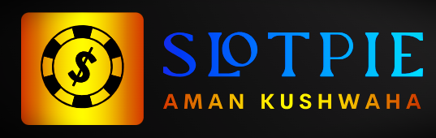

**An online 3D slot machine game.**
  
## Information 

The game features a slot machine with three reels and four fruits, 🍒🍎🍌🍋. Fruit combinations reward the players with 🪙.

## Features  
 
- Fully responsive for desktop and mobile
- Players can spin the slot machine either by clicking on the _Spin button_ or by pressing _Space_
- Orbit controls: clicking and holding mouse while moving the cursors allows players to change 3D view
- Help modal that contains instructions and all winning fruit combinations

### Winning fruit combinations

| Fruits | Rewards |
| :----: | ------: |
| 🍒🍒🍒 |   50 🪙 |
| 🍎🍎🍎 |    20🪙 |
| 🍌🍌🍌 |    15🪙 |
| 🍋🍋🍋 |     3🪙 |
|  🍒🍒  |    40🪙 |
|  🍎🍎  |    10🪙 |
|  🍌🍌  |     5🪙 |

**Please note that slot machines only consider pairs a match if they are in order from left to right.**

## Technologies

The core technologies of _SlotPie_ are JavaScript, WebGL and WebAssembly (WASM). The following libraries and tools are used:

| Name               | Description                                  |
| -----------------  | -------------------------------------------- |
| React              | Component-based, front-end interface library |
| Three.js         | 3D graphics API for the web, based on WebGL  |
| React Three Fiber  | A React renderer for Three.js                |
| Drei               | Useful helpers for React Three Fiber         |
| R3F-Perf            | Performance monitoring                       |
| Zustand            | State management                             |
| Vite              | Frontend development tooling                 |
|                  |                                              |

 

## Software Used

A non-exhaustive list of all the software that was used during the development of _SlotPie_.

- Visual Studio Code
- Blender
- Adobe Illustrator
- Krita
- Inkscape
- Figma

## License

Copyright (c) 2022 Aman Kushwaha 

